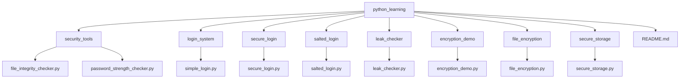

====================================================
🐍 MY PYTHON LEARNING JOURNEY
======================================================

Welcome to my personal Python learning repository!

This repo documents my progress from complete beginner to building real, security-related projects — step by step. 
Each stage reflects a mix of learning, experimenting, and hands-on coding.

----------------------------------------------------
## 🧠 Tech Stack
----------------------------------------------------

---

----------------------------------------------------
📘 LEARNING TIMELINE
----------------------------------------------------

SETUP & BASICS
--------------
Day 1:
  - Installed Python, VS Code, and WSL.
  - Learned print(), variables, input(), and basic maths.

LOGIC & FLOW
-------------
Day 2:
  - Learned if, elif, else for decision-making.
  - Built a simple login check program.

LOOPS & FUNCTIONS
-----------------
Day 3:
  - Practised for and while loops.
  - Created reusable functions using def.

SECURE CODING
-------------
Day 4:
  - Learned what password hashing is and why it’s vital for security.
  - Explored the `hashlib` module for creating secure SHA-256 hashes.
  - Created a reusable `hash_password()` function.
  - Upgraded the login system to store **hashed passwords** instead of plain text.
  - Learned how to compare hashed passwords for secure logins.

DATA SECURITY & STORAGE
-----------------------
Day 5:
  - Discovered “salting” — adding unique random data to each password hash.
  - Used Python’s `os.urandom()` and `binascii` to generate salts.
  - Switched from `.txt` to a `.json` file for structured, safer storage.
  - Implemented login verification using both hash and salt.
  - Began exploring encryption vs. hashing concepts.

CYBERSECURITY TOOLS
-------------------
Day 6:
  - Learned how password leak databases (like *Have I Been Pwned*) work.
  - Used Python’s `requests` library to access the Pwned Passwords API.
  - Implemented a local, privacy-safe password checker.
  - Compared SHA-1 hashes to detect breached passwords.
  - Understood the difference between hashing and encryption.

ENCRYPTION BASICS
-----------------
Day 7:
  - Learned difference between hashing (one-way) and encryption (two-way).
  - Installed and used the `cryptography` library.
  - Implemented key generation, encryption, and decryption.
  - Stored keys in a file for safe reuse.

FILE ENCRYPTION
---------------
Day 8:
  - Learned how to encrypt and decrypt entire files.
  - Used `cryptography.Fernet` for symmetric file encryption.
  - Practised reading/writing binary data safely.
  - Built a menu-based tool for secure file handling.
  - Strengthened understanding of real-world encryption workflows.

MULTI-USER ENCRYPTED STORAGE
----------------------------
Day 9:
  - Combined password hashing, salting, JSON storage, and Fernet encryption.
  - Built a multi-user login system with individual encryption keys.
  - Implemented file encryption and decryption per user.
  - Added layered menus and secure credential management.
  - Strengthened understanding of applied cryptography and user data isolation.

## 🧩 Projects

### 🧱 Project 1: Password Strength Checker
- Checked password length, symbols, and complexity.
- Rated password strength as weak, moderate, or strong.

### 🧰 Project 2: File Integrity Checker
- Compared two files using SHA-256 hashing.
- Detected file tampering or corruption.

### 🔑 Project 3: Simple Login System
- Created a text-file database for usernames and passwords.
- Built a menu with options to register, log in, or exit.

### 🔒 Project 4: Secure Login System (v2)
- Learned about password hashing using the `hashlib` module.
- Rebuilt the login system to store hashed passwords instead of plain text.
- Implemented user registration, secure login comparison, and simple file handling.
- Verified that the system safely stores non-reversible password hashes (SHA-256).

### 🧂 Project 5: Salted JSON Login System (v3)
- Introduced password **salting** to make each stored hash unique.
- Used `os.urandom()` and `binascii` to generate and manage salts.
- Moved from `.txt` to `.json` storage for structured user data.
- Strengthened overall security by combining salt + hash verification.

### 🔍 Project 6: Password Leak Checker
- Built a tool that checks if passwords appear in known data breaches.
- Uses the *Have I Been Pwned* API with k-anonymity for privacy.
- Compares SHA-1 hashes locally without exposing user passwords.

### 🔐 Project 7: Fernet Encryption Demo
- Built a tool that encrypts and decrypts text using Fernet symmetric encryption.
- Implemented secure key generation and storage.
- Explored difference between encryption and hashing.

### 🧱 Project 8: File Encryption & Decryption Tool
- Created a utility to encrypt and decrypt any text file.
- Implemented safe key storage and binary file operations.
- Used Fernet symmetric encryption for data confidentiality.

### 🧳 Project 9: Multi-User Encrypted File Storage System
- Combined authentication, hashing, salting, and encryption into one system.
- Each user has their own Fernet key for encrypting/decrypting files.
- Supports registration, login, logout, file encryption, and decryption.
- Demonstrates real-world secure storage workflow.

NEXT STEPS
----------

----------------------------------------------------
📊 SUMMARY OF PROGRESS
----------------------------------------------------

| Topic                           | Description                                       | Status       |
|---------------------------------|---------------------------------------------------|---------------|
| Environment Setup               | Installed Python, VS Code, WSL                    | ✅ Complete  |
| Python Basics                   | Variables, types, input/output, print()           | ✅ Complete  |
| Control Flow                    | if, elif, else statements                         | ✅ Complete  |
| Loops & Functions               | for, while, def                                   | ✅ Complete  |
| Project 1: Password Checker     | Tested password complexity rules                  | ✅ Complete  |
| Project 2: File Integrity Check | Compared file hashes using hashlib                | ✅ Complete  |
| Project 3: Simple Login System  | Created text-based user login menu                | ✅ Complete  |
| Project 4: Secure Login System  | Added password hashing with hashlib (SHA-256)     | ✅ Complete  |
| Project 5: Salted JSON Login    | Added password salting and JSON-based storage     | ✅ Complete  |
| Project 6: Password Leak Checker | Checked passwords against breach database | ✅ Complete |
| Project 7: Fernet Encryption Demo | Implemented message encryption & decryption | ✅ Complete |
| Project 8: File Encryption Tool | Encrypted and decrypted full files securely       | ✅ Complete  |
| Project 9: Multi-User Storage     | Built multi-user encrypted file storage system    | ✅ Complete  |
| Next Project                      | Secure file sharing & access logging              | 🔜 Upcoming  |

----------------------------------------------------
🧩 PROJECTS IN THIS REPOSITORY
----------------------------------------------------

| Folder             | Description                                          |
|--------------------|------------------------------------------------------|
| security_tools/    | Password Strength Checker & File Integrity Tool      |
| login_system/      | Simple Login System (text-based)                     |
| secure_login/      | Login System with SHA-256 password hashing           |
| salted_login/      | Login System with password salting & JSON storage    |
| leak_checker/      | Password Leak Checker using Have I Been Pwned API    |
| encryption_demo/   | Fernet Encryption Demo for message encryption        |
| file_encryption/   | File Encryption & Decryption Tool (Fernet-based)     |
| secure_storage/    | Multi-User Encrypted File Storage System              
| (root directory)   | Early Python learning exercises (loops, if, etc.)        |
   |
## 🗂 Repository Structure

## 🎯 Current Learning Focus
- Deepen understanding of Python fundamentals.
- Learn secure coding and file handling.
- Explore cybersecurity tools and automation.
- Build small utilities for personal and educational use.

----------------------------------------------------
🚀 NEXT GOALS
----------------------------------------------------

----------------------------------------------------
📅 SNAPSHOT
----------------------------------------------------

Start Date: October 2025  
Current Progress: 6 Projects Completed  
Next Milestone: Encryption Demo (Fernet) and Secure File Handling  

----------------------------------------------------
📂 REPOSITORY
----------------------------------------------------

GitHub: https://github.com/Hawkins30/python_learning
Last Updated: October 29, 2025

---

## 💬 Connect With Me

---

## 🧾 License
This repository is for **personal learning and educational purposes**.  
All code and notes are written by Alex Hawkins.
