====================================================
🐍 MY PYTHON LEARNING JOURNEY
======================================================

Welcome to my personal Python learning repository!

This repo documents my progress from complete beginner to building real, security-related projects — step by step. 
Each stage reflects a mix of learning, experimenting, and hands-on coding.

----------------------------------------------------
## 🧠 Tech Stack
----------------------------------------------------

---

----------------------------------------------------
📘 LEARNING TIMELINE
----------------------------------------------------

| Phase                              | Focus                            | Summary                                                              |
| ---------------------------------- | -------------------------------- | -------------------------------------------------------------------- |
| **Setup & Basics**                 | Python Fundamentals              | Installed environment, learned print(), variables, loops, and logic. |
| **Phase 1: Foundations**           | Security Fundamentals            | Built password tools, file hashing, and login systems.               |
| **Phase 2: Encryption Layer**      | Cryptography & Data Protection   | Applied hashing, salting, and encryption to real use cases.          |
| **Phase 3: Communication Systems** | Secure Messaging & File Transfer | Implemented sockets, RSA encryption, and signature verification.     |
| **Phase 4: Application Tools**     | Secure User Applications         | Created encrypted vaults, keychains, and note systems.               |

## Phase 1

SETUP & BASICS
--------------
Day 1:
  - Installed Python, VS Code, and WSL.
  - Learned print(), variables, input(), and basic maths.

LOGIC & FLOW
-------------
Day 2:
  - Learned if, elif, else for decision-making.
  - Built a simple login check program.

LOOPS & FUNCTIONS
-----------------
Day 3:
  - Practised for and while loops.
  - Created reusable functions using def.

SECURE CODING
-------------
Day 4:
  - Learned what password hashing is and why it’s vital for security.
  - Explored the `hashlib` module for creating secure SHA-256 hashes.
  - Created a reusable `hash_password()` function.
  - Upgraded the login system to store **hashed passwords** instead of plain text.
  - Learned how to compare hashed passwords for secure logins.

DATA SECURITY & STORAGE
-----------------------
Day 5:
  - Discovered “salting” — adding unique random data to each password hash.
  - Used Python’s `os.urandom()` and `binascii` to generate salts.
  - Switched from `.txt` to a `.json` file for structured, safer storage.
  - Implemented login verification using both hash and salt.
  - Began exploring encryption vs. hashing concepts.

CYBERSECURITY TOOLS
-------------------
Day 6:
  - Learned how password leak databases (like *Have I Been Pwned*) work.
  - Used Python’s `requests` library to access the Pwned Passwords API.
  - Implemented a local, privacy-safe password checker.
  - Compared SHA-1 hashes to detect breached passwords.
  - Understood the difference between hashing and encryption.

ENCRYPTION BASICS
-----------------
Day 7:
  - Learned difference between hashing (one-way) and encryption (two-way).
  - Installed and used the `cryptography` library.
  - Implemented key generation, encryption, and decryption.
  - Stored keys in a file for safe reuse.

FILE ENCRYPTION
---------------
Day 8:
  - Learned how to encrypt and decrypt entire files.
  - Used `cryptography.Fernet` for symmetric file encryption.
  - Practised reading/writing binary data safely.
  - Built a menu-based tool for secure file handling.
  - Strengthened understanding of real-world encryption workflows.

MULTI-USER ENCRYPTED STORAGE
----------------------------
Day 9:
  - Combined password hashing, salting, JSON storage, and Fernet encryption.
  - Built a multi-user login system with individual encryption keys.
  - Implemented file encryption and decryption per user.
  - Added layered menus and secure credential management.
  - Strengthened understanding of applied cryptography and user data isolation.

SECURE FILE SHARING & ACCESS LOGGING
------------------------------------
Day 10:
  - Built a secure file sharing system with access logs.
  - Learned to record user actions (encryption, decryption, sharing).
  - Added multi-user file sharing functionality.
  - Implemented JSON-based logging for audit trails.
  - Strengthened understanding of user accountability in cybersecurity tools.

SECURE CLOUD STORAGE & KEY MANAGEMENT
-------------------------------------
Day 11:
  - Learned how to manage encryption keys securely for each user.
  - Built a local “cloud” storage system using encrypted file uploads.
  - Implemented key generation, loading, and revocation.
  - Added versioned file uploads and secure downloads.
  - Strengthened understanding of real-world key management principles.

TWO-FACTOR AUTHENTICATION (2FA)
-------------------------------
Day 12:
  - Implemented Two-Factor Authentication (2FA) using time-based one-time passwords (TOTP).
  - Used the `pyotp` library to generate and verify 6-digit codes.
  - Integrated OTP verification with existing login systems.
  - Strengthened user authentication by requiring both password and OTP.
  - Learned how 2FA enhances real-world account security.

ENCRYPTED MESSAGING SYSTEM
--------------------------
Day 13:
  - Learned asymmetric encryption (RSA public/private key cryptography).
  - Built a secure encrypted messaging system between two users.
  - Implemented key generation, message encryption, and decryption.
  - Stored messages in encrypted form and decrypted only with the recipient’s private key.
  - Gained an understanding of public key exchange and secure communication principles.

DIGITAL SIGNATURES & MESSAGE AUTHENTICATION
-------------------------------------------
Day 14:
  - Learned how to digitally sign messages using RSA private keys.
  - Built a system to verify message authenticity with public keys.
  - Implemented SHA-256 hashing and PSS padding for secure signatures.
  - Ensured that any tampering invalidates the signature.
  - Strengthened understanding of real-world identity verification and trust in communication systems.

SECURE FILE TRANSFER SYSTEM
---------------------------
Day 15:
  - Combined encryption and digital signatures into one workflow.
  - Built a secure file transfer system similar to HTTPS principles.
  - Encrypted files using Fernet (symmetric key) and protected the key with RSA.
  - Digitally signed files with the sender’s private key and verified with the sender’s public key.
  - Ensured data confidentiality, authenticity, and integrity during transfer.

SECURE REAL-TIME CHAT SYSTEM
----------------------------
Day 16:
  - Learned socket programming and network communication basics.
  - Built a local encrypted chat system between two users.
  - Implemented symmetric encryption (Fernet) for message security.
  - Ensured all data is transmitted securely, with no plain text ever sent.
  - Simulated how real-world encrypted messengers and HTTPS use encryption keys.

SECURE EMAIL SYSTEM (ENCRYPTION + SIGNATURES)
---------------------------------------------
Day 17:
  - Combined encryption, digital signatures, and storage into one workflow.
  - Built a local secure email system with inbox/outbox simulation.
  - Used RSA for key exchange and Fernet for message encryption.
  - Digitally signed all messages for sender verification.
  - Ensured confidentiality, authenticity, and integrity of stored messages.

SECURE FILE VAULT (PASSWORD-PROTECTED STORAGE)
----------------------------------------------
Day 18:
  - Learned how to turn passwords into encryption keys using PBKDF2.
  - Built a secure file vault protected by a master password.
  - Implemented encryption and decryption using Fernet keys derived from a password.
  - Stored encrypted file data safely in a JSON vault file.
  - Ensured files cannot be accessed or decrypted without the correct password.

SECURE KEYCHAIN & PASSWORD MANAGER
----------------------------------
Day 19:
  - Built a local, encrypted password manager protected by a master password.
  - Used PBKDF2 to derive a cryptographic key from the master password.
  - Encrypted all saved passwords using Fernet symmetric encryption.
  - Implemented add, retrieve, view, and delete functionality for stored accounts.
  - Learned how password managers like KeePass or Bitwarden protect local data.

SECURE NOTES APP (ENCRYPTED TEXT STORAGE)
-----------------------------------------
Day 20:
  - Created a secure note-taking system with full encryption.
  - Implemented password-based key derivation using PBKDF2.
  - Encrypted and decrypted note content with Fernet.
  - Added the ability to add, view, edit, delete, and list notes.
  - Learned how encrypted text storage works in apps like Evernote or Notion.

## 🧩 Projects

### 🧱 Project 1: Password Strength Checker
- Checked password length, symbols, and complexity.
- Rated password strength as weak, moderate, or strong.

### 🧰 Project 2: File Integrity Checker
- Compared two files using SHA-256 hashing.
- Detected file tampering or corruption.

### 🔑 Project 3: Simple Login System
- Created a text-file database for usernames and passwords.
- Built a menu with options to register, log in, or exit.

### 🔒 Project 4: Secure Login System (v2)
- Learned about password hashing using the `hashlib` module.
- Rebuilt the login system to store hashed passwords instead of plain text.
- Implemented user registration, secure login comparison, and simple file handling.
- Verified that the system safely stores non-reversible password hashes (SHA-256).

### 🧂 Project 5: Salted JSON Login System (v3)
- Introduced password **salting** to make each stored hash unique.
- Used `os.urandom()` and `binascii` to generate and manage salts.
- Moved from `.txt` to `.json` storage for structured user data.
- Strengthened overall security by combining salt + hash verification.

### 🔍 Project 6: Password Leak Checker
- Built a tool that checks if passwords appear in known data breaches.
- Uses the *Have I Been Pwned* API with k-anonymity for privacy.
- Compares SHA-1 hashes locally without exposing user passwords.

### 🔐 Project 7: Fernet Encryption Demo
- Built a tool that encrypts and decrypts text using Fernet symmetric encryption.
- Implemented secure key generation and storage.
- Explored difference between encryption and hashing.

### 🧱 Project 8: File Encryption & Decryption Tool
- Created a utility to encrypt and decrypt any text file.
- Implemented safe key storage and binary file operations.
- Used Fernet symmetric encryption for data confidentiality.

### 🧳 Project 9: Multi-User Encrypted File Storage System
- Combined authentication, hashing, salting, and encryption into one system.
- Each user has their own Fernet key for encrypting/decrypting files.
- Supports registration, login, logout, file encryption, and decryption.
- Demonstrates real-world secure storage workflow.

### 🧾 Project 10: Secure File Sharing & Access Logging
- Built a secure file sharing system with per-user encryption.
- Added detailed access logging for encryption, decryption, and sharing events.
- Enabled sharing between users with individual keys.
- Created a log viewer to audit file access history.

### ☁️ Project 11: Secure Cloud Storage & Key Management System
- Created a secure, local “cloud” file storage system.
- Implemented per-user encryption key management (generate, load, revoke).
- Added file upload, download, and versioning using Fernet encryption.
- Simulated a real-world secure storage and key infrastructure.

### 🔢 Project 12: Two-Factor Authentication (2FA) System
- Built a password + OTP-based authentication system using `pyotp`.
- Added time-based One-Time Passwords (TOTP) for extra security.
- Users receive a unique secret key for use with an Authenticator app.
- Demonstrates real-world multi-step authentication workflow.

### 💬 Project 13: Encrypted Messaging System with Key Exchange
- Created a secure encrypted messaging system using RSA key pairs.
- Implemented asymmetric encryption for end-to-end privacy.
- Each user has a private key (kept secret) and a public key (shared).
- Messages are encrypted with the recipient’s public key and decrypted with their private key.
- Simulates the foundation of modern secure messaging apps.

### 🪶 Project 14: Digital Signatures & Message Authentication
- Implemented digital signatures using RSA private/public key pairs.
- Messages are signed by the sender and verified by recipients.
- Prevents message forgery and detects tampering.
- Introduces cryptographic integrity and non-repudiation.

### 📦 Project 15: Secure File Transfer System
- Combined symmetric (Fernet) and asymmetric (RSA) encryption methods.
- Encrypted files for transfer, digitally signed them, and verified on receipt.
- Prevented tampering or impersonation through signature verification.
- Mimics real-world secure data transmission (similar to HTTPS or email encryption).

### 💬 Project 16: Secure Real-Time Chat System
- Built a local client-server chat using Python sockets.
- Messages are encrypted using Fernet before being sent.
- Decrypted instantly on receipt for real-time communication.
- Simulates secure, end-to-end encrypted messaging systems.

### 📧 Project 17: Secure Email System (Encryption + Signatures)
- Created a secure local “email” environment between users.
- Messages are encrypted with Fernet and keys exchanged via RSA.
- Digital signatures verify message integrity and sender identity.
- Simulates how encrypted email (PGP-style) works internally.

### 🧱 Project 18: Secure File Vault (Password-Protected Storage)
- Created a password-protected encrypted vault for file storage.
- Used PBKDF2 key derivation to generate cryptographic keys from user passwords.
- Encrypted and decrypted files directly from within the vault interface.
- Stored encrypted content securely in JSON format with unique salt values.
- Prevents unauthorized access even if vault files are stolen.

### 🔑 Project 19: Secure Keychain & Password Manager
- Created a secure local password vault protected by a master password.
- Used PBKDF2 + Fernet to encrypt and decrypt account credentials.
- Stored account data safely in encrypted JSON format.
- Supported adding, viewing, retrieving, and deleting passwords.
- Demonstrates principles behind real-world password management tools.

### 🧾 Project 20: Secure Notes App (Encrypted Text Storage)
- Built an encrypted local note-taking system protected by a master password.
- Used PBKDF2 to generate a cryptographic key from the password.
- Stored all note content encrypted in JSON format.
- Supported creating, viewing, editing, and deleting notes securely.
- Demonstrates how encrypted cloud note apps handle local storage security.

----------------------------------------------------
📊 SUMMARY OF PROGRESS
----------------------------------------------------

| Category       | Skills Developed                    | Tools & Libraries   |
| -------------- | ----------------------------------- | ------------------- |
| Fundamentals   | Variables, loops, conditionals, I/O | Python Core         |
| Data Handling  | JSON, file operations               | OS, JSON            |
| Authentication | Passwords, hashing, salting, OTP    | hashlib, pyotp      |
| Cryptography   | Symmetric/Asymmetric Encryption     | cryptography, RSA   |
| Networking     | Secure communication channels       | sockets             |
| Applications   | Secure tools & utilities            | PBKDF2, Fernet, CLI |

| Topic                           | Description                                       | Status       |
|---------------------------------|---------------------------------------------------|---------------|
| Environment Setup               | Installed Python, VS Code, WSL                    | ✅ Complete  |
| Python Basics                   | Variables, types, input/output, print()           | ✅ Complete  |
| Control Flow                    | if, elif, else statements                         | ✅ Complete  |
| Loops & Functions               | for, while, def                                   | ✅ Complete  |
| Project 1: Password Checker     | Tested password complexity rules                  | ✅ Complete  |
| Project 2: File Integrity Check | Compared file hashes using hashlib                | ✅ Complete  |
| Project 3: Simple Login System  | Created text-based user login menu                | ✅ Complete  |
| Project 4: Secure Login System  | Added password hashing with hashlib (SHA-256)     | ✅ Complete  |
| Project 5: Salted JSON Login    | Added password salting and JSON-based storage     | ✅ Complete  |
| Project 6: Password Leak Checker | Checked passwords against breach database | ✅ Complete |
| Project 7: Fernet Encryption Demo | Implemented message encryption & decryption | ✅ Complete |
| Project 8: File Encryption Tool | Encrypted and decrypted full files securely       | ✅ Complete  |
| Project 9: Multi-User Storage     | Built multi-user encrypted file storage system    | ✅ Complete  |
| Project 10: Secure Sharing & Logs | Added file sharing between users with access logs | ✅ Complete  |
| Project 11: Cloud Storage System  | Built secure cloud storage & key management       | ✅ Complete  |
| Project 12: 2FA Authentication    | Added two-factor authentication using OTP codes   | ✅ Complete  |
| Project 13: Encrypted Messaging   | Created encrypted messaging system with RSA keys  | ✅ Complete  |
| Project 14: Digital Signatures    | Built message signing & verification system       | ✅ Complete  |
| Project 15: Secure File Transfer  | Combined encryption & signatures for file transfer| ✅ Complete  |
| Project 16: Secure Chat System    | Real-time encrypted messaging using sockets       | ✅ Complete  |
| Project 17: Secure Email System   | Combined RSA, Fernet, and signatures for emails   | ✅ Complete  |
| Project 18: Secure File Vault     | Password-protected encrypted vault system         | ✅ Complete  |
| Project 19: Secure Keychain       | Local encrypted password manager (PBKDF2 + Fernet)| ✅ Complete  |
| Project 20: Secure Notes App      | Encrypted text storage with password protection   | ✅ Complete  |
| Next Project                      | Secure Desktop App (GUI) + SQLite Integration     | 🔜 Upcoming  |

----------------------------------------------------
🧩 PROJECTS IN THIS REPOSITORY
----------------------------------------------------

| Folder             | Description                                          |
|--------------------|------------------------------------------------------|
| security_tools/    | Password Strength Checker & File Integrity Tool      |
| login_system/      | Simple Login System (text-based)                     |
| secure_login/      | Login System with SHA-256 password hashing           |
| salted_login/      | Login System with password salting & JSON storage    |
| leak_checker/      | Password Leak Checker using Have I Been Pwned API    |
| encryption_demo/   | Fernet Encryption Demo for message encryption        |
| file_encryption/   | File Encryption & Decryption Tool (Fernet-based)     |
| secure_storage/    | Multi-User Encrypted File Storage System              
| secure_sharing/    | Secure File Sharing & Access Logging System              |
| cloud_storage/     | Secure Cloud Storage & Key Management System             |
| two_factor_auth/   | Two-Factor Authentication System (password + OTP)        |
| encrypted_messaging/   | Encrypted Messaging System with RSA Key Exchange         |
| digital_signatures/    | Digital Signature & Message Authentication System        |
| secure_file_transfer/   | Secure File Transfer System (Encryption + Signing)       |
| secure_chat/            | Secure Real-Time Chat System (Encrypted Client/Server)   |
| secure_email/           | Secure Email System (Encryption + Signatures)            |
| secure_vault/           | Secure File Vault (Password-Protected Storage)           |
| secure_keychain/        | Secure Keychain & Password Manager (PBKDF2 + Fernet)     |
| secure_notes/           | Secure Notes App (Encrypted Text Storage)                |
| (root directory)   | Early Python learning exercises (loops, if, etc.)        |

## 🗂 Project Relationships

```mermaid
graph TD
  subgraph Phase1["🧩 Foundations"]
    P1["1️⃣ Password Strength Checker"]
    P2["2️⃣ File Integrity Checker"]
    P3["3️⃣ Simple Login System"]
    P4["4️⃣ Secure Login System"]
    P5["5️⃣ Salted JSON Login"]
    P6["6️⃣ Password Leak Checker"]
  end

  subgraph Phase2["🔐 Encryption & Hashing"]
    P7["7️⃣ Fernet Encryption Demo"]
    P8["8️⃣ File Encryption Tool"]
    P9["9️⃣ Multi-User Encrypted Storage"]
    P10["🔟 Secure Sharing & Logs"]
  end

  subgraph Phase3["🌐 Network & Communication Security"]
    P11["11️⃣ Cloud Storage System"]
    P12["12️⃣ Two-Factor Authentication"]
    P13["13️⃣ Encrypted Messaging"]
    P14["14️⃣ Digital Signatures"]
    P15["15️⃣ Secure File Transfer"]
    P16["16️⃣ Secure Chat System"]
    P17["17️⃣ Secure Email System"]
  end

  subgraph Phase4["📦 Secure Applications"]
    P18["18️⃣ Secure File Vault"]
    P19["19️⃣ Secure Keychain"]
    P20["20️⃣ Secure Notes App"]
  end

  P1 --> P2
  P2 --> P3
  P3 --> P4
  P4 --> P5
  P5 --> P6
  P6 --> P7
  P7 --> P8
  P8 --> P9
  P9 --> P10
  P10 --> P11
  P11 --> P12
  P12 --> P13
  P13 --> P14
  P14 --> P15
  P15 --> P16
  P16 --> P17
  P17 --> P18
  P18 --> P19
  P19 --> P20
```

----------------------------------------------------
🏁 MILESTONE SUMMARY
----------------------------------------------------

After 20 projects, this repository now contains a complete foundation in Python and applied cybersecurity principles.  
Over the course of this journey, I’ve learned:

- Python fundamentals (variables, logic, loops, functions)
- File handling, JSON storage, and user authentication
- Password hashing, salting, and encryption (SHA-256, PBKDF2, Fernet)
- Network communication (sockets, clients, servers)
- Digital signatures and message integrity
- Secure system design and user input validation
- Local encrypted data management for vaults, chat, and notes

This concludes **Phase 1: Core Security Tools in Python.**

Next up:  
**Phase 2 — Building a GUI Security Suite**  
Using **Tkinter** and **Flask**, I’ll turn these CLI tools into a full desktop and web application — combining encryption, login systems, and user interfaces into one cohesive suite.

----------------------------------------------------
📅 SNAPSHOT
----------------------------------------------------

| Stat                | Detail                  |
| ------------------- | ----------------------- |
| Start Date          | October 2025            |
| Projects Completed  | 20                      |
| Total Lines of Code | ~2,000+                 |
| Current Focus       | Secure App Development  |
| Next Milestone      | GUI + Flask Integration |

----------------------------------------------------
📂 REPOSITORY
----------------------------------------------------

GitHub: https://github.com/Hawkins30/python_learning
Last Updated: October 29, 2025

---

## 💬 Connect With Me

---

## 🧾 License
This repository is for **personal learning and educational purposes**.  
All code and notes are written by Alex Hawkins.
